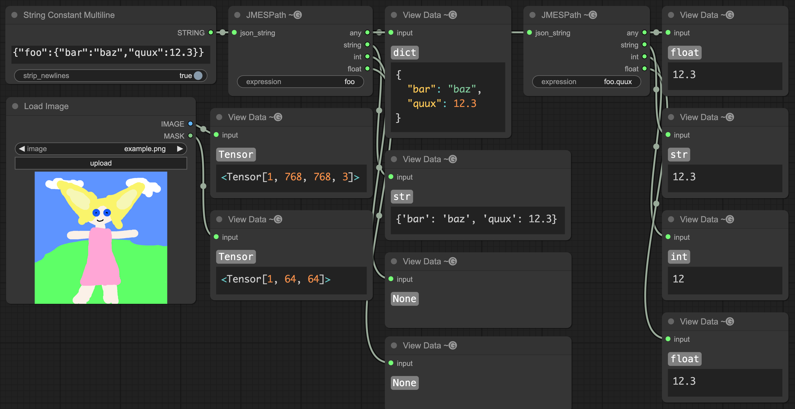

# ComfyUI-JMESPath

A ComfyUI node that runs a [JMESPath](https://jmespath.org) query against input JSON and outputs the result.



## Installation

### ComfyUI-Manager

- Open the manager
- Pick "Install via Git URL"
- Enter `https://github.com/Gremlation/ComfyUI-JMESPath`

You may need to edit `custom_nodes/ComfyUI-Manager/config.ini` and set `security_level = normal-` first.

### Manual

Run the following commands in the terminal:

```shell
cd custom_nodes
git clone https://github.com/Gremlation/ComfyUI-JMESPath
```

Then restart ComfyUI.
